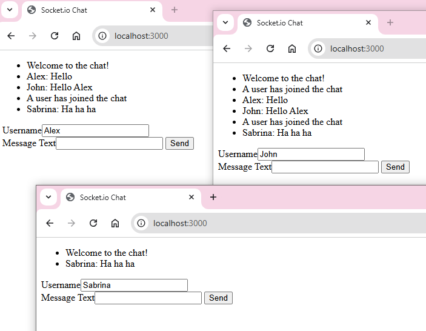

# Simple chat

This project implements a simple chat application using WebSockets technology. The primary goal is to demonstrate real-time messaging between clients via WebSockets.

## Table of Contents

- [Features](#features)
- [Technologies Used](#technologies-used)
- [Instruction](#instruction)
- [Demo](#demo)
- [Contributing](#contributing)
- [License](#license)

## Features

- Real-time messaging with Socket.IO
- Welcome message for new users
- Notification when a user joins or leaves the chat
- Broadcast messages to all connected users

## Technologies Used

- **Node.js**: JavaScript runtime for server-side development.
- **Socket.IO**: Library for real-time web applications.
- **HTTP**: Built-in module for creating the HTTP server.

## Instruction

### Getting Started

Follow the steps below to run this project locally.

### Prerequisites

Ensure you have the following installed on your system:

- **Node.js**
- **npm**

### Installation

1. Clone this repository:

   ```bash
   git clone https://github.com/sh-sofi/simple_chat.git
   ```

2. Navigate to the project folder:

   ```bash
   cd simple_chat
   ```

3. Install dependencies:

   ```bash
   npm install
   ```

4. Start the server:

   ```bash
   npm start
   ```

5. Open your browser and go to:
   ```bash
   http://localhost:3000
   ```

### Usage

1. When a user connects, they receive a welcome message.
2. Whenever a new user joins the chat, all users are notified.
3. Users can send messages that are broadcast to everyone in the chat.
4. When a user disconnects, all users are notified.
5. You can open several browser windows to simulate multiple users chatting with each other.

## Demo



## Contributing

This is a learning project, so contributions are not expected. However, feel free to fork and experiment with it. For suggestions or feedback, please open an issue.

## License

This project is licensed under the MIT License. See the LICENSE file for details.

##

Repository created during the course by ITVDN "Node.js Essential".

Special thanks to the course instructor for guidance and learning materials. 🙌
